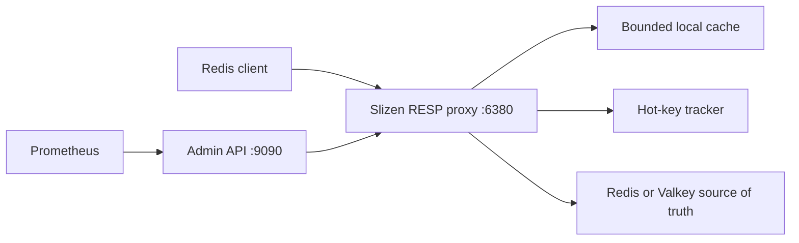

# Slizen

[](https://github.com/slizendb/slizen/actions/workflows/ci.yml)


[Polski](README.pl.md) · [Русский](README.ru.md)

**Developer preview.** A local hot-key cache for Redis and Valkey.

Slizen is a single-node RESP proxy for read-heavy workloads. It detects hot
keys, admits them to a bounded local cache, and coalesces concurrent misses.
Redis or Valkey remains the source of truth.

Slizen is useful when a small set of keys dominates reads and reducing origin
load matters more than removing proxy latency. It is not a fit for Redis
Cluster, Sentinel failover, broad Redis command compatibility, or workloads
that require direct upstream writes to become visible immediately.

**Release status:** [v0.2.2](https://github.com/slizendb/slizen/releases/tag/v0.2.2)
is the stable developer preview.

**v0.2.3-rc.1 prerelease for staging trials:** this source tree tracks
[v0.2.3-rc.1](https://github.com/slizendb/slizen/releases/tag/v0.2.3-rc.1).

> [!WARNING]
> v0.2 has no downstream RESP authentication or TLS, no upstream TLS, and no
> built-in authentication on the admin API. Keep its network paths private.



## Quick start

### Local demo

The demo requires Docker Compose. It starts a disposable Valkey instance and
Slizen in cache mode, checks the service endpoints, and runs a short hot-key
workload.

```sh
git clone https://github.com/slizendb/slizen.git
cd slizen
make demo
curl http://127.0.0.1:9090/v1/status
make demo-down
```

The stack exposes Valkey on `127.0.0.1:6379`, the Slizen RESP proxy on
`127.0.0.1:6380`, and the admin API on `127.0.0.1:9090`.

### Observe an existing instance

The image below is the verified v0.2.2 build. It starts in `observe` mode, so
reads still go to Redis or Valkey while Slizen records bounded hot-key
telemetry.

```sh
export SLIZEN_IMAGE=ghcr.io/slizendb/slizen@sha256:7989b6ff17659b3f1b2f1d3feec8af6422b48f1f5486eb77247a5c82ba86b627
docker pull "$SLIZEN_IMAGE"

docker run --rm \
  --add-host=host.docker.internal:host-gateway \
  -p 127.0.0.1:6380:6380 \
  -p 127.0.0.1:9090:9090 \
  -e SLIZEN_MODE=observe \
  -e SLIZEN_PROXY_LISTEN=0.0.0.0:6380 \
  -e SLIZEN_ADMIN_LISTEN=0.0.0.0:9090 \
  -e SLIZEN_UPSTREAM_ADDRESS=host.docker.internal:6379 \
  "$SLIZEN_IMAGE"
```

```sh
redis-cli -p 6380 GET an-existing-key
curl http://127.0.0.1:9090/v1/status
curl http://127.0.0.1:9090/v1/hotkeys
```

See [Configuration](docs/CONFIGURATION.md) for credentials, limits, and all
environment variables.

## Cache policy

Slizen starts in `observe` mode. Its three policy modes are:

- `deny`: forward requests without caching or hot-key tracking. This is not an ACL.
- `observe`: track hot keys but always read from the origin.
- `cache`: admit hot keys to the local cache within explicit size and TTL limits.

Rules use literal, case-sensitive longest-prefix matching. This example keeps
the default path in `observe`, denies session tracking, and caches one catalog
prefix:

```toml
mode = "cache"

[[cache.policies]]
prefix = ""
mode = "observe"

[[cache.policies]]
prefix = "session:"
mode = "deny"

[[cache.policies]]
prefix = "catalog:featured:"
mode = "cache"
max_item_bytes = 1048576
max_local_ttl = "10s"
```

Global `mode = "observe"` is a safety ceiling: matching `cache` rules cannot
override it. Policy count, prefix size, tracked keys, cache entries, cache
bytes, item size, and local TTL are all bounded. See
[Configuration](docs/CONFIGURATION.md) and
[ADR 0004](docs/adr/0004-per-prefix-cache-policy.md) for the full contract.

## Compatibility

v0.2 implements a small Redis command surface:

| Commands | Behavior |
| --- | --- |
| `GET`, `MGET` | Cache-aware in `cache`; always forwarded in `observe`. |
| `SET`, `SETEX`, `PSETEX`, `DEL`, `UNLINK`, `EXPIRE`, `PEXPIRE`, `PERSIST` | Forwarded and invalidate affected local state. |
| `TTL`, `PTTL`, `EXISTS` | Passed through to the origin. |
| `PING` | Handled by Slizen. |
| `SELECT 0` | Accepted as a no-op. Other databases are rejected. |
| Transactions, pub/sub, `MONITOR`, blocking commands | Rejected. |
| Unlisted commands | Rejected. |

Some accepted commands support fewer argument forms than Redis. Check the
[compatibility contract](docs/REDIS_COMPATIBILITY.md) before changing an
application endpoint. The v0.2.3 source tree can also check a command inventory:

```sh
go run ./cmd/slizenctl compatibility report --output json --accept-limitations GET MGET SET TTL
go run ./cmd/slizenctl compatibility report --output json GET EVAL
```

The report describes the binary; it does not inspect application traffic.
Version-specific behavior is documented in the
[v0.2.2 notes](docs/RELEASE_NOTES_v0.2.2.md) and
[v0.2.3-rc.1 notes](docs/RELEASE_NOTES_v0.2.3-rc.1.md).

## Consistency

Supported writes are safest when they pass through Slizen, which invalidates
affected local state. Direct writes to Redis or Valkey may remain stale in
Slizen until the local TTL expires.

The cache and hotness tracker are disposable. By default, Slizen does not serve
stale values during an origin outage. `observe` mode never stores or serves
local values.

## Kubernetes staging

Start with the [30-minute observe install](docs/STAGING_QUICKSTART.md), then use
the [staging runbook](docs/STAGING_ROLLOUT.md). The repository includes an
[observe-first sidecar](deploy/kubernetes/observe-sidecar.yaml) and a
[standalone Helm chart](charts/slizen/README.md).

The chart renders a default-deny ingress NetworkPolicy. Add only the required
application and monitoring peers. Each Pod owns an independent cache; v0.2 does
not broadcast invalidations between replicas. Read the
[failure-mode contract](docs/FAILURE_MODES.md) before a cache-mode trial.

```sh
make validate-k8s
```

## Security and privacy

- Keep the RESP and origin paths private; v0.2 does not provide RESP
  authentication or TLS and cannot connect to a TLS-only origin.
- Bind the RESP listener to loopback or restrict it to named clients with a
  default-deny NetworkPolicy.
- Test client startup before rollout. Clients that automatically send `AUTH`,
  require TLS, or depend on unsupported `HELLO` or `CLIENT` forms may fail.
- The admin API has no authentication and binds to `127.0.0.1:9090` by default.
- Values are not exposed in logs, metrics, or the admin API. Hot-key identifiers
  use HMAC-SHA256 by default, and Redis keys are never Prometheus labels.

See the [threat model](docs/THREAT_MODEL.md) and
[configuration guide](docs/CONFIGURATION.md) before staging.

## Observability

```sh
curl http://127.0.0.1:9090/healthz
curl http://127.0.0.1:9090/readyz
curl http://127.0.0.1:9090/v1/status
curl http://127.0.0.1:9090/v1/hotkeys
curl http://127.0.0.1:9090/v1/audit
curl http://127.0.0.1:9090/v1/cache
curl http://127.0.0.1:9090/metrics
```

`/v1/audit` returns bounded hot-key recommendations with stable reason codes.
`telemetry_complete=false` means the report is incomplete because of its
requested limit, tracking capacity, eviction, or the key-length limit.

The repository includes a [Grafana dashboard and Prometheus staging
rules](docs/OBSERVABILITY.md). Use Redis or Valkey `INFO commandstats`, or an
origin-side exporter, when you need physical origin command volume.

Cache entries can be purged globally or by exact key:

```sh
go run ./cmd/slizenctl cache purge --admin http://127.0.0.1:9090
go run ./cmd/slizenctl cache purge --key product:iphone_17 --admin http://127.0.0.1:9090
```

## Evidence

The v0.2.3-rc.1 release ran four isolated 100,000-operation workloads. The
published image reduced physical origin `GET` volume by **97.5% to 99.2%** with
no request failures, value mismatches, or validation failures. Direct Redis or
Valkey p99 was lower in every scenario. This is evidence of origin-load
reduction, not a claim that the proxy makes every request faster.

The earlier v0.2.2 artifact recorded **89.8% fewer logical upstream `GET`
calls** in its 1,000-key skewed workload. It did not capture origin
`commandstats`, so that result is not physical wire-command evidence. See the
[raw v0.2.2 result](https://github.com/slizendb/slizen/releases/download/v0.2.2/slizen-workload-result.json)
and the [benchmark methodology](docs/BENCHMARKING.md).

Reproduce the workload locally:

```sh
make demo-up
make benchmark
make benchmark-workload
make demo-report
```

Results depend on the runner, configuration, key distribution, and client
behavior. Measure with your own workload before enabling cache mode.

## Development

```sh
go fmt ./...
go vet ./...
go test ./...
go test -race ./...
go build ./...
```

```sh
make check
make validate-k8s
make demo-up
make demo
make smoke
make demo-report
make demo-down
```

See [CONTRIBUTING.md](CONTRIBUTING.md) for the development workflow and
[docs/RELEASE_CHECKLIST.md](docs/RELEASE_CHECKLIST.md) for release validation.

## Documentation

- [Architecture](docs/ARCHITECTURE.md)
- [Configuration](docs/CONFIGURATION.md)
- [Redis compatibility](docs/REDIS_COMPATIBILITY.md)
- [Staging rollout](docs/STAGING_ROLLOUT.md)
- [Failure modes](docs/FAILURE_MODES.md)
- [Observability](docs/OBSERVABILITY.md)
- [Benchmarking](docs/BENCHMARKING.md)
- [Roadmap](docs/ROADMAP.md)

## Design partners

We are looking for three teams that have dealt with real Redis or Valkey
hot-key incidents. If you can test a single-node developer preview in an
isolated environment, [describe the workload without including sensitive
data](https://github.com/slizendb/slizen/issues/new?template=design-partner.yml).

## License

Apache-2.0. Copyright 2026 SlizenDB contributors. See [LICENSE](LICENSE) and [NOTICE](NOTICE).
