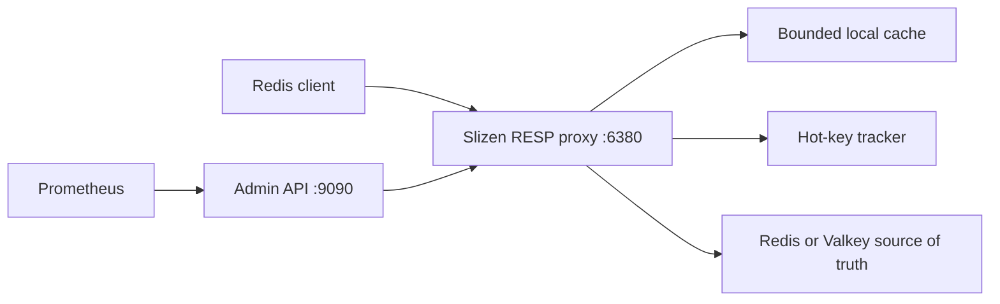

# Slizen

[](https://github.com/slizendb/slizen/actions/workflows/ci.yml)


**Developer Preview.** Hot-key autopilot for Redis and Valkey.

Slizen is a self-hosted adaptive cache layer for read-heavy Redis and Valkey workloads. It detects read-hot keys, promotes them into a bounded local cache, coalesces cache misses, and protects your upstream from sudden traffic spikes.

Slizen v0.2 is single-node, not a source of truth, and has limited Redis compatibility. Direct upstream writes may remain stale until local TTL expiration. The admin API binds locally by default and has no built-in authentication in v0.2.

**Evidence, not a speed claim.** In the reproducible, image-bound v0.2.1 synthetic 1,000-key 99/1-skew run, Slizen measured **88.734% fewer origin GETs per successful read** with zero request failures and zero value or final-validation mismatches. Proxy p99 was `2.856 ms` versus `1.777 ms` direct, so this does not claim that Slizen was faster. See the [raw release JSON](https://github.com/slizendb/slizen/releases/download/v0.2.1/slizen-workload-result.json) and [methodology](docs/BENCHMARKING.md); results are specific to that runner, configuration, and workload.

We are looking for three design partners with real Redis or Valkey hot-key incidents. If you can test a single-node developer preview in an isolated environment, [describe the workload without sensitive data](https://github.com/slizendb/slizen/issues/new?template=design-partner.yml).



## Install

The public multi-architecture image is published on GHCR. `0.2` tracks the latest v0.2 patch; use the immutable digest recorded by release evidence for a reproducible deployment.

```sh
docker pull ghcr.io/slizendb/slizen:0.2
```

Run observe-only against Redis or Valkey on the host:

```sh
docker run --rm \
  --add-host=host.docker.internal:host-gateway \
  -p 127.0.0.1:6380:6380 \
  -p 127.0.0.1:9090:9090 \
  -e SLIZEN_MODE=observe \
  -e SLIZEN_PROXY_LISTEN=0.0.0.0:6380 \
  -e SLIZEN_ADMIN_LISTEN=0.0.0.0:9090 \
  -e SLIZEN_UPSTREAM_ADDRESS=host.docker.internal:6379 \
  ghcr.io/slizendb/slizen:0.2
```

See the [latest release](https://github.com/slizendb/slizen/releases/latest), [v0.2.2 release notes](docs/RELEASE_NOTES_v0.2.2.md), and [configuration safety guide](docs/CONFIGURATION.md).

## Quick Start From Source

Requires Docker Compose.

```sh
git clone https://github.com/slizendb/slizen.git
cd slizen
make demo-up
make demo
curl http://127.0.0.1:9090/v1/status
make demo-down
```

For local Go-only development against an existing Redis or Valkey on `127.0.0.1:6379`:

```sh
cp slizen.example.toml slizen.toml
go run ./cmd/slizend --config ./slizen.toml
redis-cli -p 6380 SET product:iphone_17 '{"name":"iPhone 17","price":999}'
redis-cli -p 6380 GET product:iphone_17
go run ./cmd/slizenctl status --admin http://127.0.0.1:9090
```

The Compose demo deliberately overrides the safe default and enables `cache` mode against its disposable Valkey container.

## Operating Modes

Slizen starts in `observe` mode by default:

```toml
mode = "observe"
```

In observe mode, Slizen still forwards commands, records bounded hot-key telemetry, updates `/v1/status`, `/v1/hotkeys`, and Prometheus metrics, but never serves local cache hits, never coalesces `GET` requests, and never stores values in the local cache. This is the safest first staging deployment mode when you want to understand key heat before allowing adaptive local caching.

### Per-prefix cache policy

Optional rules under `[[cache.policies]]` use literal, case-sensitive longest-prefix matching. To promote selected prefixes, switch the global mode to `cache`, retain an empty-prefix `observe` catch-all, and add narrower cache rules:

```toml
mode = "cache"

[[cache.policies]]
prefix = ""
mode = "observe"

[[cache.policies]]
prefix = "session:"
mode = "deny"

[[cache.policies]]
prefix = "catalog:featured:"
mode = "cache"
max_item_bytes = 1048576
max_local_ttl = "10s"
```

`deny` bypasses local caching and hotness tracking but still forwards Redis reads and writes; it is not an ACL. `observe` tracks heat but always reads upstream. `cache` enables adaptive caching and requires explicit item-size and fresh-TTL caps. `max_item_bytes` uses Slizen's estimated stored entry size, including key bytes and entry overhead. An empty prefix is a catch-all, unmatched keys inherit the global mode, and global `mode = "observe"` remains a safety ceiling that disables local caching even for matching `cache` rules. Configuration is capped at 1,024 policies, 1,024 bytes per prefix, 262,144 prefix bytes in total, and 100,000 tracked keys. Redis keys longer than 1,024 bytes are still forwarded for supported commands but are deliberately excluded from hotness telemetry and local caching. See [configuration safety](docs/CONFIGURATION.md) and [ADR 0004](docs/adr/0004-per-prefix-cache-policy.md) for the complete contract.

## Docker Compose Demo

```sh
make demo-up
redis-cli -p 6380 SET product:iphone_17 '{"name":"iPhone 17","price":999}'
redis-cli -p 6380 GET product:iphone_17
make demo
curl http://127.0.0.1:9090/v1/status
make demo-down
```

`make demo` also starts the stack if it is not already running, verifies `/healthz`, `/readyz`, `/v1/status`, `/metrics`, writes and reads a test key through Slizen, runs a short Black Friday demo, and leaves the stack running for inspection.

```sh
./scripts/demo.sh
```

The Compose stack exposes Valkey directly on `127.0.0.1:6379`, Slizen RESP on `127.0.0.1:6380`, and the Slizen admin API on `127.0.0.1:9090`.

## Kubernetes staging

v0.2 includes an observe-first [sidecar example](deploy/kubernetes/observe-sidecar.yaml) and a [standalone Helm chart](charts/slizen/README.md). Neither injects containers or acts as an Operator. Read the [staging rollout and rollback guide](docs/STAGING_ROLLOUT.md) before changing a client endpoint.

```sh
make validate-k8s
```

## Supported Commands

See [docs/REDIS_COMPATIBILITY.md](docs/REDIS_COMPATIBILITY.md) for the v0.2 compatibility contract.

| Command | Behavior |
| --- | --- |
| `GET` | Cache-aware read in `cache` mode; observation and upstream forwarding only in `observe` mode. |
| `MGET` | Ordered multi-key read with local hits in `cache` mode; upstream forwarding only in `observe` mode. |
| `SET` | Write-through to upstream, then local invalidation. |
| `SETEX` | Write-through to upstream, then local invalidation. |
| `PSETEX` | Write-through to upstream, then local invalidation. |
| `DEL` | Write-through to upstream, then local invalidation. |
| `UNLINK` | Write-through to upstream, then local invalidation. |
| `EXPIRE` | Write-through to upstream, then local invalidation. |
| `PEXPIRE` | Write-through to upstream, then local invalidation. |
| `PERSIST` | Write-through to upstream, then local invalidation. |
| `TTL` | Passed through to upstream. |
| `PTTL` | Passed through to upstream. |
| `EXISTS` | Passed through to upstream in v0.2. |
| `PING` | Handled by Slizen. |
| `SELECT 0` | Accepted as a no-op for database 0. |
| `SELECT` other databases | Rejected. |
| `MULTI`, `EXEC`, `WATCH`, pub/sub, `MONITOR`, blocking commands | Rejected as stateful or unsafe. |
| Other commands | Rejected unless explicitly added in a future compatibility update. |

Slizen does not claim complete Redis compatibility.

## Consistency Model

Redis or Valkey remains authoritative. Slizen is safe when writes pass through Slizen because accepted writes invalidate affected local entries, and bounded cache epochs prevent overlapping read misses from restoring a pre-write value afterward. If an upstream write returns an error with an ambiguous outcome, Slizen conservatively invalidates the affected local entries. Direct writes to the upstream may remain stale until local TTL expiration.

The cache is disposable. Restarting Slizen may lose cached values and hotness state. During upstream outages, stale reads are disabled by default; enabling them requires `cache.allow_stale_on_upstream_error = true`. In `observe` mode, Slizen does not read from or write to the local cache at all.

## Security Notes

The admin API is unauthenticated in v0.2 and binds to `127.0.0.1:9090` by default. Do not expose it publicly without an external authentication and network policy layer.

Slizen never exposes raw values in logs, metrics, or the admin API. Admin hot-key output uses HMAC-SHA256 identifiers by default. Set `privacy.key_visibility = "plain"` only on private trusted admin listeners during local debugging. Never use Redis keys as Prometheus labels.

## Observability

```sh
curl http://127.0.0.1:9090/healthz
curl http://127.0.0.1:9090/readyz
curl http://127.0.0.1:9090/v1/status
curl http://127.0.0.1:9090/v1/hotkeys
curl http://127.0.0.1:9090/v1/audit
curl http://127.0.0.1:9090/v1/cache
curl http://127.0.0.1:9090/metrics
```

`/v1/audit` returns a bounded, machine-readable hot-key report with stable recommendation reason codes. It includes effective policy modes but never policy prefixes or Redis values; key identifiers follow `privacy.key_visibility` and are HMAC-based by default. `telemetry_complete=false` means the requested limit truncated the current set, tracking evicted a key, or at least one key over the 1,024-byte tracking limit was skipped. The same report is available through `go run ./cmd/slizenctl audit --admin http://127.0.0.1:9090`.

`/v1/status` includes the active mode. Prometheus metrics include request counts and latency, cache hits and misses, retained cache bytes and entries, evictions, upstream requests and errors, hot-key count, promotions, demotions, invalidations, coalesced requests, and skipped oversized hotness observations. Expired entries may remain in bounded cache storage until access or eviction, including while eligible for an explicitly configured stale-grace fallback. Redis keys are never used as labels.

## Cache Administration

```sh
go run ./cmd/slizenctl cache purge --admin http://127.0.0.1:9090
go run ./cmd/slizenctl cache purge --key product:iphone_17 --admin http://127.0.0.1:9090
```

## Benchmarks and Load Demo

Reproducible hot-key benchmark:

```sh
make demo-up
make benchmark
make benchmark-workload
make demo-report
```

The benchmark compares direct origin GETs with Slizen cold and hot reads, then reports cache hit ratio and origin GET reduction from real `/v1/status` counters. The workload suite verifies every successful GET against a deterministic key-specific payload; any value mismatch invalidates the evidence. See [docs/BENCHMARKING.md](docs/BENCHMARKING.md).

Go microbenchmarks:

```sh
go test -bench=. ./...
```

This is local evidence, not a scientific production benchmark. Do not assume Slizen is faster for every workload.

## Development

```sh
go fmt ./...
go vet ./...
go test ./...
go test -race ./...
go build ./...
make check
make release-check
```

Docker:

```sh
make demo-up
make demo
make smoke
make demo-report
make demo-down
```

Release prep:

- [CHANGELOG.md](CHANGELOG.md)
- [docs/DEMO.md](docs/DEMO.md)
- [docs/BENCHMARKING.md](docs/BENCHMARKING.md)
- [docs/STAGING_ROLLOUT.md](docs/STAGING_ROLLOUT.md)
- [docs/REDIS_COMPATIBILITY.md](docs/REDIS_COMPATIBILITY.md)
- [docs/RELEASE_CHECKLIST.md](docs/RELEASE_CHECKLIST.md)
- [docs/PUBLIC_RELEASE_CHECKLIST.md](docs/PUBLIC_RELEASE_CHECKLIST.md)
- [docs/RELEASE_NOTES_v0.1.md](docs/RELEASE_NOTES_v0.1.md)
- [docs/RELEASE_NOTES_v0.2.md](docs/RELEASE_NOTES_v0.2.md)
- [docs/RELEASE_NOTES_v0.2.1.md](docs/RELEASE_NOTES_v0.2.1.md)
- [docs/RELEASE_NOTES_v0.2.2.md](docs/RELEASE_NOTES_v0.2.2.md)

## Limitations

- v0.2 is single-node only.
- Slizen is not a source of truth.
- Slizen does not yet replicate values between Slizen nodes.
- Direct upstream writes may remain stale until local TTL expiration.
- Slizen is not fully Redis-compatible.
- `observe` mode is intended for safe heat discovery and does not reduce upstream read load.
- Negative caching is not implemented in v0.2.2; the reserved `cache.negative_ttl` setting must remain `0s`.
- Admin API authentication is not built in.
- Production use requires careful workload testing.

## Roadmap

The v0.2.2 performance release candidate is complete; tag, image, and immutable evidence publication remain. It preserves the single-node safe-staging scope while reducing measured proxy tax and improving workload attribution. v0.3 moves direct-origin invalidation forward with Redis/Valkey server-assisted tracking and fail-safe behavior. Mesh, an Operator, and a hosted control plane are later hypotheses that require evidence from real users rather than version promises.

Gossip does not provide write consensus. Slizen remains a cache layer.

## License

Apache-2.0. Copyright 2026 SlizenDB contributors. See [LICENSE](LICENSE) and [NOTICE](NOTICE).
