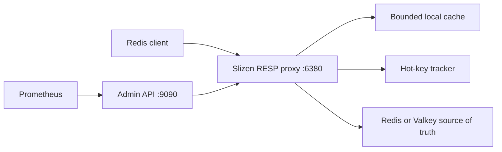

# Slizen

[](https://github.com/slizendb/slizen/actions/workflows/ci.yml)


**Developer Preview.** Hot-key autopilot for Redis and Valkey.

Slizen is a self-hosted adaptive cache layer for read-heavy Redis and Valkey workloads. It detects read-hot keys, promotes them into a bounded local cache, coalesces cache misses, and protects your upstream from sudden traffic spikes.

Slizen v0.2 is single-node, not a source of truth, and has limited Redis compatibility. Its upstream is one standalone Redis/Valkey address; Cluster redirections and Sentinel discovery/failover are not supported. Direct upstream writes may remain stale until local TTL expiration. It does not implement downstream RESP authentication/TLS or upstream Redis/Valkey TLS. Keep every plaintext path private; bind the RESP listener to Pod/host loopback or restrict it to explicitly approved clients with a NetworkPolicy. The admin API also has no built-in authentication and binds locally by default.

**Evidence, not a speed claim.** In the reproducible, image-bound v0.2.2 synthetic 1,000-key 99/1-skew run, Slizen measured **89.778% fewer logical upstream GET calls** (`94,961` direct successful GETs versus `9,707` Slizen calls), a `73.628%` cache-hit ratio, and zero request failures, value mismatches, or final-validation failures or mismatches. That historical artifact did not capture Redis/Valkey `commandstats`, so the reduction is a proxy-side estimate rather than proof of physical wire-command volume. Attributed read p99 was `2.137 ms` through Slizen versus `1.460 ms` direct, so this does not claim that Slizen was faster. See the [raw release JSON](https://github.com/slizendb/slizen/releases/download/v0.2.2/slizen-workload-result.json) and [methodology](docs/BENCHMARKING.md); results are specific to that runner, configuration, and workload.

**v0.2.3-rc.1 prerelease for staging trials.** The exact published image reduced physical origin GETs by `97.516%`, `97.969%`, `99.201%`, and `99.130%` in the four isolated 100,000-operation workloads, with zero request failures, value mismatches, or validation failures/mismatches. Direct p99 remained lower in every scenario, so this is an upstream-load result, not a speed claim or universal 99% guarantee. The release-bound Helm chart, sidecar manifest, checksums, provenance, and raw evidence are attached to the [GitHub prerelease](https://github.com/slizendb/slizen/releases/tag/v0.2.3-rc.1). Stable aliases and the default install below remain on v0.2.2 until an external staging trial passes.

We are looking for three design partners with real Redis or Valkey hot-key incidents. If you can test a single-node developer preview in an isolated environment, [describe the workload without sensitive data](https://github.com/slizendb/slizen/issues/new?template=design-partner.yml).



## Install

The public multi-architecture image is published on GHCR. `0.2` is a mutable
discovery alias; the runnable path below pins the verified v0.2.2 digest.

```sh
export SLIZEN_IMAGE=ghcr.io/slizendb/slizen@sha256:7989b6ff17659b3f1b2f1d3feec8af6422b48f1f5486eb77247a5c82ba86b627
docker pull "$SLIZEN_IMAGE"
```

Run observe-only against Redis or Valkey on the host:

```sh
docker run --rm \
  --add-host=host.docker.internal:host-gateway \
  -p 127.0.0.1:6380:6380 \
  -p 127.0.0.1:9090:9090 \
  -e SLIZEN_MODE=observe \
  -e SLIZEN_PROXY_LISTEN=0.0.0.0:6380 \
  -e SLIZEN_ADMIN_LISTEN=0.0.0.0:9090 \
  -e SLIZEN_UPSTREAM_ADDRESS=host.docker.internal:6379 \
  "$SLIZEN_IMAGE"
```

For Kubernetes, start with the [30-minute observe install](docs/STAGING_QUICKSTART.md), then use the full [staging runbook](docs/STAGING_ROLLOUT.md). See the [latest release](https://github.com/slizendb/slizen/releases/latest), [v0.2.2 release notes](docs/RELEASE_NOTES_v0.2.2.md), and [configuration safety guide](docs/CONFIGURATION.md).

## Quick Start From Source

Requires Docker Compose.

```sh
git clone https://github.com/slizendb/slizen.git
cd slizen
make demo-up
make demo
curl http://127.0.0.1:9090/v1/status
make demo-down
```

For local Go-only development against an existing Redis or Valkey on `127.0.0.1:6379`:

```sh
cp slizen.example.toml slizen.toml
go run ./cmd/slizend --config ./slizen.toml
redis-cli -p 6380 SET product:iphone_17 '{"name":"iPhone 17","price":999}'
redis-cli -p 6380 GET product:iphone_17
go run ./cmd/slizenctl status --admin http://127.0.0.1:9090
```

The Compose demo deliberately overrides the safe default and enables `cache` mode against its disposable Valkey container.

## Operating Modes

Slizen starts in `observe` mode by default:

```toml
mode = "observe"
```

In observe mode, Slizen still forwards commands, records bounded hot-key telemetry, updates `/v1/status`, `/v1/hotkeys`, and Prometheus metrics, but never serves local cache hits, never coalesces `GET` requests, and never stores values in the local cache. This is the safest first staging deployment mode when you want to understand key heat before allowing adaptive local caching.

### Per-prefix cache policy

Optional rules under `[[cache.policies]]` use literal, case-sensitive longest-prefix matching. To promote selected prefixes, switch the global mode to `cache`, retain an empty-prefix `observe` catch-all, and add narrower cache rules:

```toml
mode = "cache"

[[cache.policies]]
prefix = ""
mode = "observe"

[[cache.policies]]
prefix = "session:"
mode = "deny"

[[cache.policies]]
prefix = "catalog:featured:"
mode = "cache"
max_item_bytes = 1048576
max_local_ttl = "10s"
```

`deny` bypasses local caching and hotness tracking but still forwards Redis reads and writes; it is not an ACL. `observe` tracks heat but always reads upstream. `cache` enables adaptive caching and requires explicit item-size and fresh-TTL caps. `max_item_bytes` uses Slizen's estimated stored entry size, including key bytes and entry overhead. An empty prefix is a catch-all, unmatched keys inherit the global mode, and global `mode = "observe"` remains a safety ceiling that disables local caching even for matching `cache` rules. Configuration is capped at 1,024 policies, 1,024 bytes per prefix, 262,144 prefix bytes in total, and 100,000 tracked keys. Redis keys longer than 1,024 bytes are still forwarded for supported commands but are deliberately excluded from hotness telemetry and local caching. See [configuration safety](docs/CONFIGURATION.md) and [ADR 0004](docs/adr/0004-per-prefix-cache-policy.md) for the complete contract.

In the v0.2.3 candidate, cache mode partitions the same global limits into a seven-eighths protected tier and a one-eighth probationary tier. The first eligible successful miss may retain a short-lived candidate; one later read can promote and serve it without another origin GET while preserving the original absolute local expiry. This adds no memory beyond `cache.max_bytes` and `cache.max_entries`.

## Docker Compose Demo

```sh
make demo-up
redis-cli -p 6380 SET product:iphone_17 '{"name":"iPhone 17","price":999}'
redis-cli -p 6380 GET product:iphone_17
make demo
curl http://127.0.0.1:9090/v1/status
make demo-down
```

`make demo` also starts the stack if it is not already running, verifies `/healthz`, `/readyz`, `/v1/status`, `/metrics`, writes and reads a test key through Slizen, runs a short Black Friday demo, and leaves the stack running for inspection.

```sh
./scripts/demo.sh
```

The Compose stack exposes Valkey directly on `127.0.0.1:6379`, Slizen RESP on `127.0.0.1:6380`, and the Slizen admin API on `127.0.0.1:9090`.

## Kubernetes staging

v0.2 includes an observe-first [sidecar example](deploy/kubernetes/observe-sidecar.yaml) and a [standalone Helm chart](charts/slizen/README.md). Neither injects containers or acts as an Operator. The Helm chart renders a default-deny ingress NetworkPolicy; declare the exact application and monitoring peers before routing traffic. Before changing a client endpoint, read the executable [staging rollout](docs/STAGING_ROLLOUT.md), [failure-mode contract](docs/FAILURE_MODES.md), [observability pack](docs/OBSERVABILITY.md), and [self-service staging gate](docs/STAGING_RELEASE_GATE.md).

Each sidecar replica owns an independent disposable cache. v0.2 does not
broadcast invalidations between application Pods, so a first cache-mode
sidecar trial must use one replica, a read-only prefix, or an explicitly
accepted local-TTL staleness budget. Multi-replica `observe` mode is safe
because it never stores or serves local values.

```sh
make validate-k8s
```

## Supported Commands

See [docs/REDIS_COMPATIBILITY.md](docs/REDIS_COMPATIBILITY.md) for the v0.2 compatibility contract.

| Command | Behavior |
| --- | --- |
| `GET` | Cache-aware read in `cache` mode; observation and upstream forwarding only in `observe` mode. |
| `MGET` | Ordered multi-key read with local hits in `cache` mode; upstream forwarding only in `observe` mode. |
| `SET` | Forwarded and conservatively invalidates local state. The v0.2.3 candidate invalidates before dispatch and can refresh an already admitted key after a successful exact option-free `SET`; stable v0.2.2 invalidates after the upstream call and does not refresh. |
| `SETEX` | Forwarded and invalidates local state; the v0.2.3 candidate moves invalidation before upstream dispatch. |
| `PSETEX` | Forwarded and invalidates local state; the v0.2.3 candidate moves invalidation before upstream dispatch. |
| `DEL` | Forwarded and invalidates local state; the v0.2.3 candidate moves invalidation before upstream dispatch. |
| `UNLINK` | Forwarded and invalidates local state; the v0.2.3 candidate moves invalidation before upstream dispatch. |
| `EXPIRE` | Forwarded and invalidates local state; the v0.2.3 candidate moves invalidation before upstream dispatch. |
| `PEXPIRE` | Forwarded and invalidates local state; the v0.2.3 candidate moves invalidation before upstream dispatch. |
| `PERSIST` | Forwarded and invalidates local state; the v0.2.3 candidate moves invalidation before upstream dispatch. |
| `TTL` | Passed through to upstream. |
| `PTTL` | Passed through to upstream. |
| `EXISTS` | Passed through to upstream in v0.2. |
| `PING` | Handled by Slizen. |
| `SELECT 0` | Accepted as a no-op for database 0. |
| `SELECT` other databases | Rejected. |
| `MULTI`, `EXEC`, `WATCH`, pub/sub, `MONITOR`, blocking commands | Rejected as stateful or unsafe. |
| Other commands | Rejected unless explicitly added in a future compatibility update. |

Slizen does not claim complete Redis compatibility.

The v0.2.3 source-tree candidate can check an explicit command inventory
offline before deployment. The full catalog is informational; an explicit
selection exits non-zero when it contains a rejected or unsupported command.
Commands whose accepted argument shapes are narrower than Redis require an
explicit limitations acknowledgement:

```sh
go run ./cmd/slizenctl compatibility report --output json --accept-limitations GET MGET SET TTL
go run ./cmd/slizenctl compatibility report --output json GET EVAL
```

This reports what the binary supports; it does not discover an application's
workload. An ad hoc `go run` report has `binary_commit=unknown`; use a stamped
published `slizenctl` report for retained staging evidence. See [the
compatibility contract](docs/REDIS_COMPATIBILITY.md).

## Consistency Model

Redis or Valkey remains authoritative. Slizen is safest when supported writes pass through Slizen. Stable v0.2.2 invalidates local state after the upstream call. The v0.2.3 candidate strengthens this by invalidating protected and probationary entries before dispatch; bounded cache epochs prevent overlapping read misses from restoring a pre-write value afterward, and a successful exact option-free `SET` can refresh only an already admitted cache-policy key after upstream acceptance. Other mutations and ambiguous errors remain conservatively invalidating. Direct writes to the upstream may leave local cache state stale until local TTL expiration.

The cache is disposable. Restarting Slizen may lose cached values and hotness state. During upstream outages, stale reads are disabled by default; enabling them requires `cache.allow_stale_on_upstream_error = true`. In `observe` mode, Slizen does not read from or write to the local cache at all.

## Security Notes

The downstream RESP listener does not support client `AUTH` or TLS in v0.2,
and the upstream client does not support Redis/Valkey TLS. Use only a private
plaintext path or a separately reviewed external termination/tunnel; a
TLS-required origin is otherwise incompatible. Bind downstream RESP to loopback
for a sidecar/local deployment, or allow only named application peers through
a default-deny NetworkPolicy. Do not expose it as a general cluster or public
Redis endpoint. Test the exact application client initialization: a client
profile that automatically sends `AUTH`, requires TLS, or cannot tolerate
Slizen rejecting unsupported `HELLO`/`CLIENT` setup is not endpoint-only
compatible. Configure origin credentials separately on Slizen.

The admin API is unauthenticated in v0.2 and binds to `127.0.0.1:9090` by default. Do not expose it publicly without an external authentication and network policy layer.

Slizen never exposes raw values in logs, metrics, or the admin API. Admin hot-key output uses HMAC-SHA256 identifiers by default. Set `privacy.key_visibility = "plain"` only on private trusted admin listeners during local debugging. Never use Redis keys as Prometheus labels.

## Observability

```sh
curl http://127.0.0.1:9090/healthz
curl http://127.0.0.1:9090/readyz
curl http://127.0.0.1:9090/v1/status
curl http://127.0.0.1:9090/v1/hotkeys
curl http://127.0.0.1:9090/v1/audit
curl http://127.0.0.1:9090/v1/cache
curl http://127.0.0.1:9090/metrics
```

`/v1/audit` returns a bounded, machine-readable hot-key report with stable recommendation reason codes. It includes effective policy modes but never policy prefixes or Redis values; key identifiers follow `privacy.key_visibility` and are HMAC-based by default. `telemetry_complete=false` means the requested limit truncated the current set, tracking evicted a key, an unseen observation was dropped to protect the current HOT FIFO victim at capacity, or at least one key over the 1,024-byte tracking limit was skipped. Capacity drops are reported as `capacity_observations_dropped`; the bounded O(1) victim rule does not promise unlimited scan resistance. The same report is available through `go run ./cmd/slizenctl audit --admin http://127.0.0.1:9090`.

`/v1/status` includes the active mode. The current v0.2.3 source tree adds
fixed-reason cache misses (`policy_bypass`, `not_admitted`, and `not_present`),
active downstream connections, configured cache-bound gauges, and
`slizen_hotness_capacity_observations_dropped_total` to the existing bounded
request, latency, cache, upstream, hotness, promotion, demotion, invalidation,
coalescing, and oversized-observation metrics. The published v0.2.2 image does
not emit those v0.2.3-only series; the supplied observability guide marks the
affected panels and fallback checks. Expired entries may remain in bounded
cache storage until access or eviction, including while eligible for an
explicitly configured stale-grace fallback. Redis keys are never used as
labels.

Import the supplied [Grafana dashboard and Prometheus staging
rules](docs/OBSERVABILITY.md) instead of inventing queries during an incident.
They keep cache-hit ratio, proxy-side logical upstream-call avoidance, latency,
errors, capacity, and telemetry completeness separate. Physical origin command
volume and retry amplification must come from Redis/Valkey `commandstats` or an
origin-side exporter; platform-level readiness and container alerts are also
still required.

## Cache Administration

```sh
go run ./cmd/slizenctl cache purge --admin http://127.0.0.1:9090
go run ./cmd/slizenctl cache purge --key product:iphone_17 --admin http://127.0.0.1:9090
```

## Benchmarks and Load Demo

Reproducible hot-key benchmark:

```sh
make demo-up
make benchmark
make benchmark-workload
make demo-report
```

The benchmark compares direct-origin and Slizen phases, then reports cache-hit
ratio from `/v1/status` and physical origin GET reduction from same-`run_id`
Redis/Valkey `INFO commandstats` deltas. The logical Slizen upstream delta is
retained separately to detect retries or unrelated origin traffic. Every
successful GET is checked against a deterministic key-specific payload; any
value mismatch or evidence-identity/isolation failure invalidates the result.
See [docs/BENCHMARKING.md](docs/BENCHMARKING.md).

Go microbenchmarks:

```sh
go test -bench=. ./...
```

This is local evidence, not a scientific production benchmark. Do not assume Slizen is faster for every workload.

## Development

```sh
go fmt ./...
go vet ./...
go test ./...
go test -race ./...
go build ./...
make check
make release-check
```

Docker:

```sh
make demo-up
make demo
make smoke
make demo-report
make demo-down
```

Release prep:

- [CHANGELOG.md](CHANGELOG.md)
- [docs/DEMO.md](docs/DEMO.md)
- [docs/BENCHMARKING.md](docs/BENCHMARKING.md)
- [docs/STAGING_ROLLOUT.md](docs/STAGING_ROLLOUT.md)
- [docs/FAILURE_MODES.md](docs/FAILURE_MODES.md)
- [docs/OBSERVABILITY.md](docs/OBSERVABILITY.md)
- [docs/STAGING_RELEASE_GATE.md](docs/STAGING_RELEASE_GATE.md)
- [docs/REDIS_COMPATIBILITY.md](docs/REDIS_COMPATIBILITY.md)
- [docs/RELEASE_CHECKLIST.md](docs/RELEASE_CHECKLIST.md)
- [docs/PUBLIC_RELEASE_CHECKLIST.md](docs/PUBLIC_RELEASE_CHECKLIST.md)
- [docs/RELEASE_NOTES_v0.1.md](docs/RELEASE_NOTES_v0.1.md)
- [docs/RELEASE_NOTES_v0.2.md](docs/RELEASE_NOTES_v0.2.md)
- [docs/RELEASE_NOTES_v0.2.1.md](docs/RELEASE_NOTES_v0.2.1.md)
- [docs/RELEASE_NOTES_v0.2.2.md](docs/RELEASE_NOTES_v0.2.2.md)
- [docs/RELEASE_NOTES_v0.2.3-rc.1.md](docs/RELEASE_NOTES_v0.2.3-rc.1.md) — published staging prerelease

## Limitations

- v0.2 is single-node only.
- Slizen is not a source of truth.
- Slizen does not yet replicate values between Slizen nodes.
- Direct upstream writes may remain stale until local TTL expiration.
- Slizen is not fully Redis-compatible.
- `observe` mode is intended for safe heat discovery and does not reduce upstream read load.
- Negative caching is not implemented in v0.2.3; the reserved `cache.negative_ttl` setting must remain `0s`.
- Admin API authentication is not built in.
- Production use requires careful workload testing.

## Roadmap

The [v0.2.2 performance release](https://github.com/slizendb/slizen/releases/tag/v0.2.2) remains the stable public install. [v0.2.3-rc.1](https://github.com/slizendb/slizen/releases/tag/v0.2.3-rc.1) was published on 2026-07-23 with a checksummed release-bound chart, sidecar manifest, exact-image physical-origin evidence, and verified provenance. It remains a staging prerelease until a team unfamiliar with Slizen independently passes the installation, rollback, failure-drill, and soak gate. v0.3 moves direct-origin invalidation forward with Redis/Valkey server-assisted tracking and fail-safe behavior. Mesh, an Operator, and a hosted control plane are later hypotheses that require evidence from real users rather than version promises.

Gossip does not provide write consensus. Slizen remains a cache layer.

## License

Apache-2.0. Copyright 2026 SlizenDB contributors. See [LICENSE](LICENSE) and [NOTICE](NOTICE).
