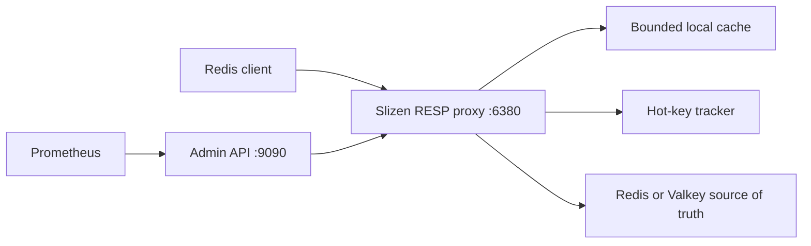

# Slizen

[](https://github.com/gazakov/slizen/actions/workflows/ci.yml)


**Developer Preview.** Hot-key autopilot for Redis and Valkey.

Slizen is a self-hosted adaptive cache layer for read-heavy Redis and Valkey workloads. It detects read-hot keys, promotes them into a bounded local cache, coalesces cache misses, and protects your upstream from sudden traffic spikes.

Slizen v0.1 is single-node, not a source of truth, and has limited Redis compatibility. Direct upstream writes may remain stale until local TTL expiration. The admin API binds locally by default and has no built-in authentication in v0.1.



## Quick Start

Requires Docker Compose.

```sh
git clone https://github.com/gazakov/slizen.git
cd slizen
make demo-up
make demo
curl http://127.0.0.1:9090/v1/status
make demo-down
```

For local Go-only development against an existing Redis or Valkey on `127.0.0.1:6379`:

```sh
cp slizen.example.toml slizen.toml
go run ./cmd/slizend --config ./slizen.toml
redis-cli -p 6380 SET product:iphone_17 '{"name":"iPhone 17","price":999}'
redis-cli -p 6380 GET product:iphone_17
go run ./cmd/slizenctl status --admin http://127.0.0.1:9090
```

## Operating Modes

Slizen starts in `cache` mode by default:

```toml
mode = "cache"
```

Set `mode = "observe"` or `SLIZEN_MODE=observe` to run Slizen as an observation-only proxy. In observe mode, Slizen still forwards commands, records bounded hot-key telemetry, updates `/v1/status`, `/v1/hotkeys`, and Prometheus metrics, but never serves local cache hits, never coalesces `GET` requests, and never stores values in the local cache. This is the safest first staging deployment mode when you want to understand key heat before allowing adaptive local caching.

## Docker Compose Demo

```sh
make demo-up
redis-cli -p 6380 SET product:iphone_17 '{"name":"iPhone 17","price":999}'
redis-cli -p 6380 GET product:iphone_17
make demo
curl http://127.0.0.1:9090/v1/status
make demo-down
```

`make demo` also starts the stack if it is not already running, verifies `/healthz`, `/readyz`, `/v1/status`, `/metrics`, writes and reads a test key through Slizen, runs a short Black Friday demo, and leaves the stack running for inspection.

```sh
./scripts/demo.sh
```

The Compose stack exposes Valkey directly on `127.0.0.1:6379`, Slizen RESP on `127.0.0.1:6380`, and the Slizen admin API on `127.0.0.1:9090`.

## Supported Commands

See [docs/REDIS_COMPATIBILITY.md](docs/REDIS_COMPATIBILITY.md) for the v0.1 compatibility contract.

| Command | Behavior |
| --- | --- |
| `GET` | Cache-aware read in `cache` mode; observation and upstream forwarding only in `observe` mode. |
| `MGET` | Ordered multi-key read with local hits in `cache` mode; upstream forwarding only in `observe` mode. |
| `SET` | Write-through to upstream, then local invalidation. |
| `SETEX` | Write-through to upstream, then local invalidation. |
| `PSETEX` | Write-through to upstream, then local invalidation. |
| `DEL` | Write-through to upstream, then local invalidation. |
| `UNLINK` | Write-through to upstream, then local invalidation. |
| `EXPIRE` | Write-through to upstream, then local invalidation. |
| `PEXPIRE` | Write-through to upstream, then local invalidation. |
| `PERSIST` | Write-through to upstream, then local invalidation. |
| `TTL` | Passed through to upstream. |
| `PTTL` | Passed through to upstream. |
| `EXISTS` | Passed through to upstream in v0.1. |
| `PING` | Handled by Slizen. |
| `SELECT 0` | Accepted as a no-op for database 0. |
| `SELECT` other databases | Rejected. |
| `MULTI`, `EXEC`, `WATCH`, pub/sub, `MONITOR`, blocking commands | Rejected as stateful or unsafe. |
| Other commands | Rejected unless explicitly added in a future compatibility update. |

Slizen does not claim complete Redis compatibility.

## Consistency Model

Redis or Valkey remains authoritative. Slizen is safe when writes pass through Slizen because accepted writes invalidate affected local entries. Direct writes to the upstream may remain stale until local TTL expiration.

The cache is disposable. Restarting Slizen may lose cached values and hotness state. During upstream outages, stale reads are disabled by default; enabling them requires `cache.allow_stale_on_upstream_error = true`. In `observe` mode, Slizen does not read from or write to the local cache at all.

## Security Notes

The admin API is unauthenticated in v0.1 and binds to `127.0.0.1:9090` by default. Do not expose it publicly without an external authentication and network policy layer.

Slizen never exposes raw values in logs, metrics, or the admin API. Admin hot-key output uses HMAC-SHA256 identifiers by default. Set `privacy.key_visibility = "plain"` only on private trusted admin listeners during local debugging. Never use Redis keys as Prometheus labels.

## Observability

```sh
curl http://127.0.0.1:9090/healthz
curl http://127.0.0.1:9090/readyz
curl http://127.0.0.1:9090/v1/status
curl http://127.0.0.1:9090/v1/hotkeys
curl http://127.0.0.1:9090/v1/cache
curl http://127.0.0.1:9090/metrics
```

`/v1/status` includes the active mode. Prometheus metrics include request counts and latency, cache hits and misses, cache bytes and entries, evictions, upstream requests and errors, hot-key count, promotions, demotions, invalidations, and coalesced requests. Redis keys are never used as labels.

## Cache Administration

```sh
go run ./cmd/slizenctl cache purge --admin http://127.0.0.1:9090
go run ./cmd/slizenctl cache purge --key product:iphone_17 --admin http://127.0.0.1:9090
```

## Benchmarks and Load Demo

Reproducible hot-key benchmark:

```sh
make demo-up
make benchmark
make demo-report
```

The benchmark compares direct origin GETs with Slizen cold and hot reads, then reports cache hit ratio and upstream GET reduction from real `/v1/status` counters. See [docs/BENCHMARKING.md](docs/BENCHMARKING.md).

Go microbenchmarks:

```sh
go test -bench=. ./...
```

This is local evidence, not a scientific production benchmark. Do not assume Slizen is faster for every workload.

## Development

```sh
go fmt ./...
go vet ./...
go test ./...
go test -race ./...
go build ./...
make check
make release-check
```

Docker:

```sh
make demo-up
make demo
make smoke
make demo-report
make demo-down
```

Release prep:

- [CHANGELOG.md](CHANGELOG.md)
- [docs/DEMO.md](docs/DEMO.md)
- [docs/BENCHMARKING.md](docs/BENCHMARKING.md)
- [docs/REDIS_COMPATIBILITY.md](docs/REDIS_COMPATIBILITY.md)
- [docs/RELEASE_CHECKLIST.md](docs/RELEASE_CHECKLIST.md)
- [docs/PUBLIC_RELEASE_CHECKLIST.md](docs/PUBLIC_RELEASE_CHECKLIST.md)
- [docs/RELEASE_NOTES_v0.1.md](docs/RELEASE_NOTES_v0.1.md)

## Limitations

- v0.1 is single-node only.
- Slizen is not a source of truth.
- Slizen does not yet replicate values between Slizen nodes.
- Direct upstream writes may remain stale until local TTL expiration.
- Slizen is not fully Redis-compatible.
- `observe` mode is intended for safe heat discovery and does not reduce upstream read load.
- Negative caching is disabled by default.
- Admin API authentication is not built in.
- Production use requires careful workload testing.

## Roadmap

v0.2 adds static multi-node membership and top-K metadata exchange. v0.3 adds adaptive placement and failure-aware ephemeral replicas. v0.4 adds Redis/Valkey server-assisted client tracking, direct-write invalidation, Kubernetes and fleet integrations, dashboards, alerts, and recommendations.

Gossip does not provide write consensus. Slizen remains a cache layer.

## License

Apache-2.0. Copyright 2026 SlizenDB contributors.
