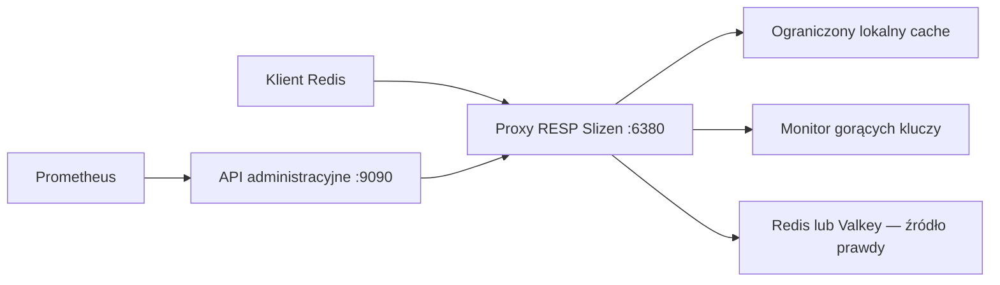

# Slizen

[](https://github.com/slizendb/slizen/actions/workflows/ci.yml)


Polski · [English](README.md) · [Русский](README.ru.md)

**Wersja deweloperska.** Lokalny cache dla gorących kluczy w Redis i Valkey.

Slizen to jednowęzłowy serwer proxy RESP dla obciążeń z przewagą odczytów.
Wykrywa gorące klucze, umieszcza je w ograniczonym lokalnym cache i scala
równoczesne odczyty, gdy brakuje wpisu w cache. Redis lub Valkey pozostaje
źródłem prawdy.

Slizen sprawdza się, gdy niewielka grupa kluczy odpowiada za większość odczytów,
a ograniczenie obciążenia źródła jest ważniejsze niż usunięcie opóźnienia
proxy. Nie jest przeznaczony do Redis Cluster, przełączania awaryjnego Sentinel,
szerokiej zgodności z poleceniami Redis ani obciążeń, w których bezpośrednie
zapisy do źródła muszą być widoczne natychmiast.

**Status wydania:** [v0.2.2](https://github.com/slizendb/slizen/releases/tag/v0.2.2)
jest stabilną wersją deweloperską.

**Wersja przedpremierowa v0.2.3-rc.1 do testów stagingowych:** bieżące
źródła odpowiadają
[v0.2.3-rc.1](https://github.com/slizendb/slizen/releases/tag/v0.2.3-rc.1).

> [!WARNING]
> v0.2 nie obsługuje uwierzytelniania ani TLS po stronie RESP, TLS do źródła
> ani wbudowanego uwierzytelniania API administracyjnego. Wszystkie połączenia
> sieciowe Slizen muszą pozostać prywatne.



## Szybki start

### Lokalne demo

Demo wymaga Docker Compose. Uruchamia tymczasową instancję Valkey oraz Slizen
w trybie `cache`, sprawdza endpointy i wykonuje krótki test gorących kluczy.

```sh
git clone https://github.com/slizendb/slizen.git
cd slizen
make demo
curl http://127.0.0.1:9090/v1/status
make demo-down
```

Valkey jest dostępny na `127.0.0.1:6379`, proxy RESP Slizen na
`127.0.0.1:6380`, a API administracyjne na `127.0.0.1:9090`.

### Obserwacja istniejącej instancji

Poniższy obraz zawiera zweryfikowaną wersję v0.2.2. Uruchamia się w trybie
`observe`: wszystkie odczyty nadal trafiają do Redis lub Valkey, a Slizen
zbiera ograniczoną telemetrię gorących kluczy.

```sh
export SLIZEN_IMAGE=ghcr.io/slizendb/slizen@sha256:7989b6ff17659b3f1b2f1d3feec8af6422b48f1f5486eb77247a5c82ba86b627
docker pull "$SLIZEN_IMAGE"

docker run --rm \
  --add-host=host.docker.internal:host-gateway \
  -p 127.0.0.1:6380:6380 \
  -p 127.0.0.1:9090:9090 \
  -e SLIZEN_MODE=observe \
  -e SLIZEN_PROXY_LISTEN=0.0.0.0:6380 \
  -e SLIZEN_ADMIN_LISTEN=0.0.0.0:9090 \
  -e SLIZEN_UPSTREAM_ADDRESS=host.docker.internal:6379 \
  "$SLIZEN_IMAGE"
```

```sh
redis-cli -p 6380 GET an-existing-key
curl http://127.0.0.1:9090/v1/status
curl http://127.0.0.1:9090/v1/hotkeys
```

Poświadczenia, limity i wszystkie zmienne środowiskowe opisano w
[dokumentacji konfiguracji](docs/CONFIGURATION.md).

## Polityka cache

Slizen domyślnie uruchamia się w trybie `observe`. Dostępne są trzy tryby
polityki:

- `deny`: przekazuje żądania bez cache i bez śledzenia gorących kluczy; nie jest
  to mechanizm ACL.
- `observe`: śledzi gorące klucze, ale zawsze czyta ze źródła.
- `cache`: umieszcza gorące klucze w lokalnym cache w ramach jawnych limitów
  rozmiaru i TTL.

Reguły używają dosłownego, rozróżniającego wielkość liter dopasowania
najdłuższego prefiksu. Poniższy przykład pozostawia domyślny ruch w `observe`,
wyłącza śledzenie sesji i zapisuje w cache jeden prefiks katalogu:

```toml
mode = "cache"

[[cache.policies]]
prefix = ""
mode = "observe"

[[cache.policies]]
prefix = "session:"
mode = "deny"

[[cache.policies]]
prefix = "catalog:featured:"
mode = "cache"
max_item_bytes = 1048576
max_local_ttl = "10s"
```

Globalne `mode = "observe"` jest ograniczeniem bezpieczeństwa: pasujące reguły
`cache` nie mogą go nadpisać. Liczba polityk, długość prefiksu, liczba
śledzonych kluczy, wpisy i rozmiar cache, rozmiar elementu oraz lokalny TTL są
ograniczone. Pełny kontrakt znajduje się w
[dokumentacji konfiguracji](docs/CONFIGURATION.md) i
[ADR 0004](docs/adr/0004-per-prefix-cache-policy.md).

## Zgodność z Redis

v0.2 obsługuje niewielki podzbiór poleceń Redis:

| Polecenia | Zachowanie |
| --- | --- |
| `GET`, `MGET` | Korzystają z cache w trybie `cache`; w `observe` zawsze trafiają do źródła. |
| `SET`, `SETEX`, `PSETEX`, `DEL`, `UNLINK`, `EXPIRE`, `PEXPIRE`, `PERSIST` | Są przekazywane i unieważniają powiązany stan lokalny. |
| `TTL`, `PTTL`, `EXISTS` | Są przekazywane do źródła. |
| `PING` | Jest obsługiwany przez Slizen. |
| `SELECT 0` | Jest akceptowany jako no-op. Inne bazy są odrzucane. |
| Transakcje, pub/sub, `MONITOR`, polecenia blokujące | Są odrzucane. |
| Polecenia niewymienione powyżej | Są odrzucane. |

Niektóre obsługiwane polecenia przyjmują mniej wariantów argumentów niż Redis.
Przed zmianą endpointu aplikacji sprawdź
[kontrakt zgodności](docs/REDIS_COMPATIBILITY.md). Źródła v0.2.3 pozwalają też
sprawdzić listę poleceń:

```sh
go run ./cmd/slizenctl compatibility report --output json --accept-limitations GET MGET SET TTL
go run ./cmd/slizenctl compatibility report --output json GET EVAL
```

Raport opisuje możliwości pliku wykonywalnego; nie analizuje ruchu aplikacji.
Różnice między wersjami opisano w informacjach o wydaniu
[v0.2.2](docs/RELEASE_NOTES_v0.2.2.md) i
[v0.2.3-rc.1](docs/RELEASE_NOTES_v0.2.3-rc.1.md).

## Spójność

Najbezpieczniej kierować obsługiwane zapisy przez Slizen, który unieważnia
powiązany stan lokalny. Bezpośrednie zapisy do Redis lub Valkey mogą pozostać
nieaktualne w Slizen do wygaśnięcia lokalnego TTL.

Stany cache i monitora gorących kluczy są nietrwałe. Domyślnie Slizen nie
zwraca nieaktualnych wartości podczas awarii źródła. Tryb `observe` nigdy nie
zapisuje ani nie zwraca lokalnych wartości.

## Testy stagingowe w Kubernetes

Zacznij od [30-minutowej instalacji w trybie observe](docs/STAGING_QUICKSTART.md),
a następnie użyj [instrukcji stagingowej](docs/STAGING_ROLLOUT.md). Repozytorium
zawiera [sidecar observe-first](deploy/kubernetes/observe-sidecar.yaml) oraz
[samodzielny chart Helm](charts/slizen/README.md).

Chart tworzy NetworkPolicy z domyślnie zablokowanym ruchem przychodzącym. Dodaj
tylko wymagane aplikacje i systemy monitoringu. Każdy Pod ma niezależny cache;
v0.2 nie rozsyła unieważnień między replikami. Przed testem trybu `cache`
przeczytaj [kontrakt zachowania przy awarii](docs/FAILURE_MODES.md).

```sh
make validate-k8s
```

## Bezpieczeństwo i prywatność

- Połączenia RESP i do źródła muszą pozostać prywatne. v0.2 nie obsługuje
  uwierzytelniania RESP ani TLS i nie połączy się ze źródłem wymagającym TLS.
- Listener RESP powinien być przypisany do loopback albo dostępny wyłącznie dla
  wskazanych klientów przez domyślnie blokującą NetworkPolicy.
- Przed wdrożeniem sprawdź inicjalizację klienta. Klienci automatycznie wysyłający
  `AUTH`, wymagający TLS albo zależni od nieobsługiwanych wariantów `HELLO` lub
  `CLIENT` mogą nie działać.
- API administracyjne nie ma uwierzytelniania i domyślnie nasłuchuje na
  `127.0.0.1:9090`.
- Wartości nie są udostępniane w logach, metrykach ani API administracyjnym.
  Identyfikatory gorących kluczy są domyślnie wyznaczane za pomocą HMAC-SHA256,
  a klucze Redis nigdy nie są używane jako etykiety Prometheus.

Przed testami stagingowymi przeczytaj [model zagrożeń](docs/THREAT_MODEL.md) i
[dokumentację konfiguracji](docs/CONFIGURATION.md).

## Monitoring i diagnostyka

```sh
curl http://127.0.0.1:9090/healthz
curl http://127.0.0.1:9090/readyz
curl http://127.0.0.1:9090/v1/status
curl http://127.0.0.1:9090/v1/hotkeys
curl http://127.0.0.1:9090/v1/audit
curl http://127.0.0.1:9090/v1/cache
curl http://127.0.0.1:9090/metrics
```

`/v1/audit` zwraca ograniczoną listę rekomendacji dotyczących gorących kluczy
ze stabilnymi kodami przyczyn. `telemetry_complete=false` oznacza, że raport
jest niepełny z powodu żądanego limitu, pojemności mechanizmu śledzenia,
usunięcia wpisu albo limitu długości klucza.

Repozytorium zawiera [dashboard Grafana i reguły stagingowe
Prometheus](docs/OBSERVABILITY.md). Do pomiaru fizycznej liczby poleceń w źródle
użyj `INFO commandstats` z Redis lub Valkey albo eksportera po stronie źródła.

Cache można wyczyścić w całości lub dla konkretnego klucza:

```sh
go run ./cmd/slizenctl cache purge --admin http://127.0.0.1:9090
go run ./cmd/slizenctl cache purge --key product:iphone_17 --admin http://127.0.0.1:9090
```

## Wyniki pomiarów

Wydanie v0.2.3-rc.1 przeszło cztery izolowane testy po 100 000 operacji.
Opublikowany obraz zmniejszył fizyczną liczbę poleceń `GET` w źródle o
**97,5%–99,2%**, bez błędów żądań, niezgodności wartości ani błędów walidacji.
Bezpośredni dostęp do Redis lub Valkey miał niższe p99 w każdym scenariuszu.
Jest to wynik dotyczący ograniczenia obciążenia źródła, a nie obietnica
przyspieszenia każdego żądania przez proxy.

Wcześniejszy artefakt v0.2.2 zarejestrował **o 89,8% mniej logicznych wywołań
`GET` do źródła** w obciążeniu z 1 000 kluczy i nierównym rozkładem. Nie
rejestrował `commandstats` źródła, więc nie jest to dowód fizycznej liczby
poleceń w sieci. Zobacz [surowy wynik
v0.2.2](https://github.com/slizendb/slizen/releases/download/v0.2.2/slizen-workload-result.json)
oraz [metodologię benchmarku](docs/BENCHMARKING.md).

Lokalne odtworzenie obciążenia:

```sh
make demo-up
make benchmark
make benchmark-workload
make demo-report
```

Wyniki zależą od maszyny, konfiguracji, rozkładu kluczy i zachowania klienta.
Przed włączeniem trybu `cache` wykonaj pomiary na własnym obciążeniu.

## Rozwój

```sh
go fmt ./...
go vet ./...
go test ./...
go test -race ./...
go build ./...
```

```sh
make check
make validate-k8s
make demo-up
make demo
make smoke
make demo-report
make demo-down
```

Przebieg prac opisano w [CONTRIBUTING.md](CONTRIBUTING.md), a walidację wydania
w [docs/RELEASE_CHECKLIST.md](docs/RELEASE_CHECKLIST.md).

## Dokumentacja

- [Architektura](docs/ARCHITECTURE.md)
- [Konfiguracja](docs/CONFIGURATION.md)
- [Zgodność z Redis](docs/REDIS_COMPATIBILITY.md)
- [Wdrożenie stagingowe](docs/STAGING_ROLLOUT.md)
- [Scenariusze awarii](docs/FAILURE_MODES.md)
- [Monitoring](docs/OBSERVABILITY.md)
- [Benchmarki](docs/BENCHMARKING.md)
- [Plan rozwoju](docs/ROADMAP.md)

## Partnerzy pilotażowi

Szukamy trzech zespołów, które mierzyły się z rzeczywistymi incydentami
gorących kluczy w Redis lub Valkey. Jeśli możesz przetestować jednowęzłową
wersję deweloperską w odizolowanym środowisku,
[opisz obciążenie bez danych wrażliwych](https://github.com/slizendb/slizen/issues/new?template=design-partner.yml).

## Licencja

Apache-2.0. Copyright 2026 SlizenDB contributors. Zobacz [LICENSE](LICENSE) i
[NOTICE](NOTICE).
