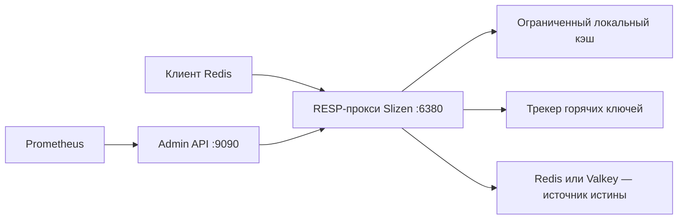

# Slizen

[](https://github.com/slizendb/slizen/actions/workflows/ci.yml)


[Polski](README.pl.md) · [English](README.md)

**Предварительная версия для разработчиков.** Локальный кэш горячих ключей для
Redis и Valkey.

Slizen — одноузловой RESP-прокси для нагрузок с преобладанием чтения. Он
выявляет горячие ключи, помещает их в ограниченный локальный кэш и объединяет
одновременные запросы при промахе кэша. Redis или Valkey остаётся источником
истины.

Slizen подходит, когда небольшая группа ключей отвечает за большую часть
чтений, а снижение нагрузки на источник важнее дополнительной задержки прокси.
Он не предназначен для Redis Cluster, аварийного переключения через Sentinel,
широкой совместимости с командами Redis и нагрузок, в которых прямые записи в
источник должны становиться видимыми немедленно.

**Статус релиза:** [v0.2.2](https://github.com/slizendb/slizen/releases/tag/v0.2.2)
— стабильная предварительная версия для разработчиков.

**v0.2.3-rc.1 — prerelease для тестирования в staging:** текущий исходный код
соответствует
[v0.2.3-rc.1](https://github.com/slizendb/slizen/releases/tag/v0.2.3-rc.1).

> [!WARNING]
> В v0.2 нет аутентификации и TLS на входящем RESP-соединении, TLS для
> подключения к источнику и встроенной аутентификации Admin API. Все сетевые
> соединения Slizen должны оставаться приватными.



## Быстрый старт

### Локальная демонстрация

Для демонстрации нужен Docker Compose. Она запускает временный экземпляр Valkey
и Slizen в режиме `cache`, проверяет служебные эндпоинты и выполняет короткую
нагрузку с горячими ключами.

```sh
git clone https://github.com/slizendb/slizen.git
cd slizen
make demo
curl http://127.0.0.1:9090/v1/status
make demo-down
```

Valkey доступен на `127.0.0.1:6379`, RESP-прокси Slizen — на
`127.0.0.1:6380`, а Admin API — на `127.0.0.1:9090`.

### Наблюдение за существующим экземпляром

В образе ниже находится проверенная версия v0.2.2. Она запускается в режиме
`observe`: все чтения продолжают поступать в Redis или Valkey, а Slizen
собирает ограниченную телеметрию горячих ключей.

```sh
export SLIZEN_IMAGE=ghcr.io/slizendb/slizen@sha256:7989b6ff17659b3f1b2f1d3feec8af6422b48f1f5486eb77247a5c82ba86b627
docker pull "$SLIZEN_IMAGE"

docker run --rm \
  --add-host=host.docker.internal:host-gateway \
  -p 127.0.0.1:6380:6380 \
  -p 127.0.0.1:9090:9090 \
  -e SLIZEN_MODE=observe \
  -e SLIZEN_PROXY_LISTEN=0.0.0.0:6380 \
  -e SLIZEN_ADMIN_LISTEN=0.0.0.0:9090 \
  -e SLIZEN_UPSTREAM_ADDRESS=host.docker.internal:6379 \
  "$SLIZEN_IMAGE"
```

```sh
redis-cli -p 6380 GET an-existing-key
curl http://127.0.0.1:9090/v1/status
curl http://127.0.0.1:9090/v1/hotkeys
```

Учётные данные, лимиты и все переменные окружения описаны в
[документации по конфигурации](docs/CONFIGURATION.md).

## Политика кэширования

По умолчанию Slizen запускается в режиме `observe`. Доступны три режима
политики:

- `deny`: передавать запросы без кэширования и отслеживания горячих ключей; это
  не механизм ACL.
- `observe`: отслеживать горячие ключи, но всегда читать из источника.
- `cache`: помещать горячие ключи в локальный кэш в пределах явно заданных
  ограничений размера и TTL.

Правила используют буквальное, чувствительное к регистру сопоставление по
самому длинному префиксу. В примере ниже основной трафик остаётся в `observe`,
отслеживание сессий отключено, а один префикс каталога кэшируется:

```toml
mode = "cache"

[[cache.policies]]
prefix = ""
mode = "observe"

[[cache.policies]]
prefix = "session:"
mode = "deny"

[[cache.policies]]
prefix = "catalog:featured:"
mode = "cache"
max_item_bytes = 1048576
max_local_ttl = "10s"
```

Глобальный `mode = "observe"` служит ограничителем безопасности: подходящие
правила `cache` не могут его переопределить. Количество политик, длина
префиксов, число отслеживаемых ключей, количество и объём записей кэша, размер
элемента и локальный TTL ограничены. Полный контракт приведён в
[документации по конфигурации](docs/CONFIGURATION.md) и
[ADR 0004](docs/adr/0004-per-prefix-cache-policy.md).

## Совместимость с Redis

v0.2 поддерживает небольшой набор команд Redis:

| Команды | Поведение |
| --- | --- |
| `GET`, `MGET` | Используют кэш в режиме `cache`; в `observe` всегда передаются источнику. |
| `SET`, `SETEX`, `PSETEX`, `DEL`, `UNLINK`, `EXPIRE`, `PEXPIRE`, `PERSIST` | Передаются источнику и инвалидируют связанное локальное состояние. |
| `TTL`, `PTTL`, `EXISTS` | Передаются источнику. |
| `PING` | Обрабатывается Slizen. |
| `SELECT 0` | Принимается как no-op. Остальные базы данных не поддерживаются. |
| Транзакции, pub/sub, `MONITOR`, блокирующие команды | Отклоняются. |
| Команды, не перечисленные выше | Отклоняются. |

Некоторые поддерживаемые команды принимают меньше вариантов аргументов, чем
Redis. Перед изменением адреса в приложении проверьте
[контракт совместимости](docs/REDIS_COMPATIBILITY.md). Исходный код v0.2.3
также позволяет проверить список команд:

```sh
go run ./cmd/slizenctl compatibility report --output json --accept-limitations GET MGET SET TTL
go run ./cmd/slizenctl compatibility report --output json GET EVAL
```

Отчёт описывает возможности исполняемого файла и не анализирует трафик
приложения. Различия между версиями описаны в примечаниях к выпускам
[v0.2.2](docs/RELEASE_NOTES_v0.2.2.md) и
[v0.2.3-rc.1](docs/RELEASE_NOTES_v0.2.3-rc.1.md).

## Согласованность данных

Поддерживаемые операции записи безопаснее всего направлять через Slizen: в этом
случае он инвалидирует связанное локальное состояние. Прямые записи в Redis или
Valkey могут оставаться устаревшими в Slizen до истечения локального TTL.

Состояние кэша и трекера горячих ключей не сохраняется. По умолчанию во время
сбоя источника Slizen не возвращает устаревшие значения. Режим `observe`
никогда не сохраняет и не возвращает локальные значения.

## Тестирование в Kubernetes

Начните с [30-минутной установки в режиме observe](docs/STAGING_QUICKSTART.md),
затем используйте [инструкцию по staging](docs/STAGING_ROLLOUT.md). В
репозитории есть [observe-first sidecar](deploy/kubernetes/observe-sidecar.yaml)
и [самостоятельный Helm chart](charts/slizen/README.md).

Chart создаёт NetworkPolicy, по умолчанию запрещающую входящий трафик. Разрешите
доступ только нужным приложениям и системам мониторинга. Каждый Pod владеет
независимым кэшем; v0.2 не рассылает инвалидации между репликами. Перед
тестированием режима `cache` прочитайте
[контракт поведения при сбоях](docs/FAILURE_MODES.md).

```sh
make validate-k8s
```

## Безопасность и приватность

- Соединения RESP и с источником должны оставаться приватными. v0.2 не
  поддерживает аутентификацию RESP или TLS и не может подключиться к источнику,
  требующему TLS.
- RESP listener должен быть привязан к loopback либо доступен только указанным
  клиентам через NetworkPolicy, по умолчанию запрещающую трафик.
- Перед развёртыванием проверьте инициализацию клиента. Клиенты, которые
  автоматически отправляют `AUTH`, требуют TLS либо зависят от
  неподдерживаемых вариантов `HELLO` или `CLIENT`, могут не работать.
- Admin API не имеет аутентификации и по умолчанию слушает
  `127.0.0.1:9090`.
- Значения не попадают в логи, метрики или Admin API. Идентификаторы горячих
  ключей по умолчанию вычисляются через HMAC-SHA256, а ключи Redis никогда не
  используются как метки Prometheus.

Перед тестированием прочитайте [модель угроз](docs/THREAT_MODEL.md) и
[документацию по конфигурации](docs/CONFIGURATION.md).

## Наблюдаемость

```sh
curl http://127.0.0.1:9090/healthz
curl http://127.0.0.1:9090/readyz
curl http://127.0.0.1:9090/v1/status
curl http://127.0.0.1:9090/v1/hotkeys
curl http://127.0.0.1:9090/v1/audit
curl http://127.0.0.1:9090/v1/cache
curl http://127.0.0.1:9090/metrics
```

`/v1/audit` возвращает ограниченный список рекомендаций по горячим ключам со
стабильными кодами причин. `telemetry_complete=false` означает, что отчёт
неполон из-за заданного лимита, ёмкости трекера, вытеснения записи или
ограничения длины ключа.

В репозитории есть [дашборд Grafana и правила Prometheus для
staging](docs/OBSERVABILITY.md). Для измерения физического количества команд в
источнике используйте `INFO commandstats` Redis или Valkey либо экспортёр на
стороне источника.

Кэш можно очистить целиком или для конкретного ключа:

```sh
go run ./cmd/slizenctl cache purge --admin http://127.0.0.1:9090
go run ./cmd/slizenctl cache purge --key product:iphone_17 --admin http://127.0.0.1:9090
```

## Результаты измерений

Для выпуска v0.2.3-rc.1 выполнены четыре изолированных теста по 100 000
операций. Опубликованный образ сократил физическое количество команд `GET` в
источнике на **97,5–99,2%** без ошибок запросов, расхождений значений и ошибок
проверки. Прямой доступ к Redis или Valkey показал меньший p99 во всех
сценариях. Это результат по снижению нагрузки на источник, а не обещание
ускорить каждый запрос с помощью прокси.

Более ранний артефакт v0.2.2 зафиксировал **на 89,8% меньше логических вызовов
`GET` к источнику** в тесте с 1 000 ключей и неравномерным распределением. В нём
не собирались `commandstats` источника, поэтому это не доказательство
физического количества сетевых команд. См.
[исходный результат v0.2.2](https://github.com/slizendb/slizen/releases/download/v0.2.2/slizen-workload-result.json)
и [методику тестирования](docs/BENCHMARKING.md).

Локальное воспроизведение нагрузки:

```sh
make demo-up
make benchmark
make benchmark-workload
make demo-report
```

Результаты зависят от оборудования, конфигурации, распределения ключей и
поведения клиента. Перед включением режима `cache` проведите измерения на своей
нагрузке.

## Разработка

```sh
go fmt ./...
go vet ./...
go test ./...
go test -race ./...
go build ./...
```

```sh
make check
make validate-k8s
make demo-up
make demo
make smoke
make demo-report
make demo-down
```

Процесс разработки описан в [CONTRIBUTING.md](CONTRIBUTING.md), а проверка
релиза — в [docs/RELEASE_CHECKLIST.md](docs/RELEASE_CHECKLIST.md).

## Документация

- [Архитектура](docs/ARCHITECTURE.md)
- [Конфигурация](docs/CONFIGURATION.md)
- [Совместимость с Redis](docs/REDIS_COMPATIBILITY.md)
- [Развёртывание в staging](docs/STAGING_ROLLOUT.md)
- [Сценарии сбоев](docs/FAILURE_MODES.md)
- [Наблюдаемость](docs/OBSERVABILITY.md)
- [Тестирование производительности](docs/BENCHMARKING.md)
- [План развития](docs/ROADMAP.md)

## Пилотные пользователи

Мы ищем три команды, которые сталкивались с реальными инцидентами из-за горячих
ключей в Redis или Valkey. Если вы можете протестировать одноузловую
предварительную версию в изолированной среде,
[опишите нагрузку без конфиденциальных данных](https://github.com/slizendb/slizen/issues/new?template=design-partner.yml).

## Лицензия

Apache-2.0. Copyright 2026 SlizenDB contributors. См. [LICENSE](LICENSE) и
[NOTICE](NOTICE).
