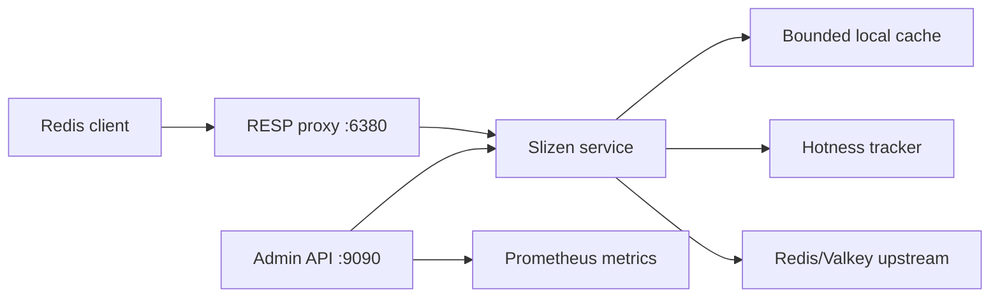

# Architecture

Slizen v0.2 is a single-node adaptive cache layer for read-heavy Redis and Valkey workloads.

## Request flow

GET first resolves an immutable, configuration-bounded per-prefix decision with literal, case-sensitive longest-prefix matching. A `deny` decision bypasses hotness and every local-cache path, `observe` records hotness but always forwards upstream, and `cache` enables the adaptive cache flow. Cache-mode GET checks local state, coalesces concurrent misses with `singleflight`, fetches from upstream on miss, and stores the value only after the key is eligible for promotion. MGET resolves each key independently, preserves input order, uses eligible local hits, and fetches all remaining keys in one upstream batch. Both refill paths use a fixed-size striped epoch guard so a read that overlaps a proxied write cannot restore a superseded value after invalidation.

In `observe` mode, Slizen still records hotness and forwards reads to upstream, but it never serves local cache hits, never coalesces `GET` requests, and never stores values locally. This mode is intended for safe heat discovery before enabling adaptive caching.

Write commands are sent upstream first. Successful writes invalidate affected local entries before Slizen replies. If the upstream returns an error, Slizen returns that error and conservatively invalidates the affected entries because a timeout or connection failure can leave the write outcome ambiguous. Cache invalidation never turns a rejected write into an acknowledged write; Redis or Valkey remains authoritative.

## Cache model

The local cache is a bounded, in-memory LRU-style cache. Size accounting includes key bytes, value bytes, and a fixed per-entry overhead estimate. This is not exact runtime heap accounting, but the approximation is enforced consistently for global capacity and per-prefix `max_item_bytes` limits.

Local TTL is the smallest of the remaining positive upstream TTL, configured `cache.max_local_ttl`, and the matching cache policy's `max_local_ttl`. Upstream keys without expiration use the applicable local cap, while values whose upstream PTTL has reached zero are not stored. Negative caching is not implemented in v0.2.1; the reserved `cache.negative_ttl` setting must remain `0s`.

## Hotness model

The hotness tracker uses bounded per-key state, fixed scoring windows, EWMA decay, promotion hysteresis, and a cooldown state. A warm key may enter `HOT` during the final required open window only when its current count already makes the eventual full-window EWMA score meet the promotion threshold even if no later request arrives. At least one completed qualifying window is still required, the real EWMA score is finalized only at the boundary, and sub-threshold or skipped windows still reset the streak. This removes boundary-alignment delay without lowering the configured threshold or minimum-window requirement. The tracker avoids retaining a counter for every key ever observed by evicting low-score or old entries when the configured maximum is reached. The configured maximum is capped at 100,000 entries. Keys over 1,024 bytes are forwarded but skipped by the tracker and therefore cannot enter the local cache; the audit completeness flag and `slizen_hotness_oversized_observations_dropped_total` expose that loss of telemetry. Window catch-up uses closed-form decay and preserves cooldown transitions without work proportional to the number of missed windows.

## Consistency model

Slizen v0.2 is safe when writes pass through Slizen. External writes directly to Redis or Valkey may remain stale until local TTL expiration. Stale reads during upstream outages are disabled by default and require explicit opt-in.

## Operations

The daemon exposes:

- RESP proxy listener, default `0.0.0.0:6380`.
- HTTP admin listener, default `127.0.0.1:9090`.

The active mode is exposed in `/v1/status`.

The admin listener is unauthenticated in v0.2 and must not be exposed publicly.

Normal response flushes receive a fresh `proxy.write_timeout` deadline, so a client that stops reading cannot pin a connection goroutine indefinitely. Steady-state handler admission uses an atomic reservation followed by a drain-state recheck, and normal completion takes the drain mutex once. A reservation that loses a race with shutdown is rolled back before any command executes. On shutdown, the proxy stops admitting new command handlers and wakes idle or partial-request clients. Accepted handlers and their connections are allowed to finish and flush for at most `proxy.shutdown_timeout`; after that deadline Slizen cancels the server-owned request context and force-closes the listener and remaining sockets.

Parsed RESP commands are admitted only within configured byte, argument, MGET-key, and connection bounds. An over-limit command receives an error and its connection closes to release the enlarged read buffer. redcon assembles one full command before invoking Slizen, so these checks bound conversion, dispatch, and upstream work rather than parser allocation. Upstream GET and MGET responses are fully materialized and do not yet have a separate heap-byte cap; container memory limits and trusted cluster-internal access remain necessary.

## Privacy

Hot-key output uses HMAC-SHA256 key identifiers by default. Raw keys are available only when `privacy.key_visibility = "plain"` or the legacy `admin.expose_raw_keys` shortcut is enabled for a trusted private admin listener. Logs use HMAC identifiers regardless of admin output visibility.
