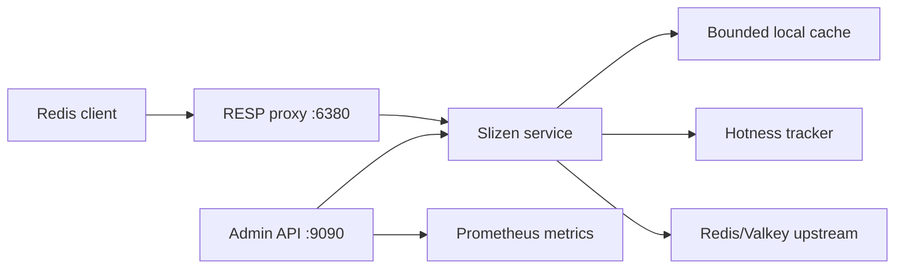

# Architecture

Slizen v0.2 is a single-node adaptive cache layer for read-heavy Redis and Valkey workloads.

## Request flow

GET first resolves an immutable, configuration-bounded per-prefix decision with literal, case-sensitive longest-prefix matching. A `deny` decision bypasses hotness and every local-cache path, `observe` records hotness but always forwards upstream, and `cache` enables the adaptive cache flow. Cache-mode GET checks protected and probationary state, coalesces concurrent misses with `singleflight`, and fetches upstream on miss. The first eligible successful miss may retain one probationary value; a later read promotes and serves that still-fresh candidate without another origin GET. Waiters joined to the first coalesced miss receive the shared authoritative response but do not count as a later admission read. MGET resolves each key independently, preserves input order, uses eligible local hits or promotions, and fetches all remaining keys in one upstream batch. Both refill paths use a fixed-size striped epoch guard so a read that overlaps a proxied write cannot restore a superseded value after invalidation.

In `observe` mode, Slizen still records hotness and forwards reads to upstream, but it never serves local cache hits, never coalesces `GET` requests, and never stores values locally. This mode is intended for safe heat discovery before enabling adaptive caching.

Supported write commands are serialized by a bounded hash stripe for their affected keys. Slizen advances the cache epoch and removes protected and probationary copies before upstream dispatch, then applies a final epoch barrier after completion so a refill overlapping either side of the write cannot restore an older value. A successful exact option-free `SET key value` may place the accepted value back into the protected tier only when the key is already admitted and its effective policy is `cache`; it does not admit a cold key. Option-bearing `SET`, every other mutation, nil replies, and errors remain invalidation-only. If upstream returns an error, Slizen returns that error and keeps the entries invalidated because a timeout or connection failure can leave the outcome ambiguous. Local handling never turns a rejected write into an acknowledged write; Redis or Valkey remains authoritative.

## Cache model

The local cache is a bounded, in-memory LRU-style cache split into two partitions within the existing global limits. Seven eighths of configured bytes and, when non-zero, entries are reserved for protected admitted values; one eighth is reserved for probationary candidates. The partitions sum to `cache.max_bytes` and `cache.max_entries`, so two-hit admission does not add memory beyond those bounds. Limits too small to split retain a protected-only cache. Size accounting includes key bytes, value bytes, and a fixed per-entry overhead estimate. This is not exact runtime heap accounting, but the approximation is enforced consistently for both partitions and per-prefix `max_item_bytes` limits.

Local TTL is the smallest of the remaining positive upstream TTL, configured `cache.max_local_ttl`, and the matching cache policy's `max_local_ttl`. A probationary candidate is capped further by `hotness.window`. Promotion copies only the candidate's remaining TTL, preserving its original absolute expiry rather than restarting the TTL. Upstream keys without expiration use the applicable local cap, while values whose upstream PTTL has reached zero are not stored. Negative caching is not implemented in v0.2.3; the reserved `cache.negative_ttl` setting must remain `0s`.

## Hotness model

The hotness tracker uses bounded per-key state, fixed scoring windows, EWMA decay, promotion hysteresis, and a cooldown state. A warm key may enter `HOT` during the final required open window only when its current count already makes the eventual full-window EWMA score meet the promotion threshold even if no later request arrives. At least one completed qualifying window is still required for that EWMA path. Independently, a later read of a live probationary candidate explicitly admits that already-observed key; this two-hit path never creates tracker state for an untracked or oversized key. Normal observation and decay can demote it later.

Tracking capacity uses a fixed FIFO admission ring and O(1) work for each unseen observation. At capacity, Slizen inspects exactly the current victim: a non-HOT entry may be reused, but a HOT victim gets a second chance and the unseen observation is dropped while the cursor advances. This protects that current HOT victim without scanning for another candidate and is not a claim of unlimited scan resistance. The bounded `capacity_observations_dropped` audit field and `slizen_hotness_capacity_observations_dropped_total` metric expose these drops; any drop makes `telemetry_complete=false`. The configured maximum is capped at 100,000 entries. Keys over 1,024 bytes are forwarded but skipped by the tracker and therefore cannot enter either cache tier; the audit completeness flag and `slizen_hotness_oversized_observations_dropped_total` expose that separate loss of telemetry. Window catch-up uses closed-form decay and preserves cooldown transitions without work proportional to the number of missed windows.

## Consistency model

Slizen v0.2 is safest when supported writes pass through Slizen. Exact option-free `SET` write-through is an optimization for already admitted keys, not a durability mechanism; every acknowledgement still comes from Redis or Valkey. External writes directly to Redis or Valkey can leave protected or probationary values stale until local TTL expiration. Stale reads during upstream outages are disabled by default and require explicit opt-in.

## Operations

The daemon exposes:

- RESP proxy listener, default `0.0.0.0:6380`.
- HTTP admin listener, default `127.0.0.1:9090`.

The active mode is exposed in `/v1/status`.

The admin listener is unauthenticated in v0.2 and must not be exposed publicly.

Normal response flushes receive a fresh `proxy.write_timeout` deadline, so a client that stops reading cannot pin a connection goroutine indefinitely. Steady-state handler admission uses an atomic reservation followed by a drain-state recheck, and normal completion takes the drain mutex once. A reservation that loses a race with shutdown is rolled back before any command executes. On shutdown, the proxy stops admitting new command handlers and wakes idle or partial-request clients. Accepted handlers and their connections are allowed to finish and flush for at most `proxy.shutdown_timeout`; after that deadline Slizen cancels the server-owned request context and force-closes the listener and remaining sockets.

Parsed RESP commands are admitted only within configured byte, argument, MGET-key, and connection bounds. An over-limit command receives an error and its connection closes to release the enlarged read buffer. redcon assembles one full command before invoking Slizen, so these checks bound conversion, dispatch, and upstream work rather than parser allocation. Upstream GET and MGET responses are fully materialized and do not yet have a separate heap-byte cap; container memory limits and trusted cluster-internal access remain necessary.

## Privacy

Hot-key output uses HMAC-SHA256 key identifiers by default. Raw keys are available only when `privacy.key_visibility = "plain"` or the legacy `admin.expose_raw_keys` shortcut is enabled for a trusted private admin listener. Logs use HMAC identifiers regardless of admin output visibility.
