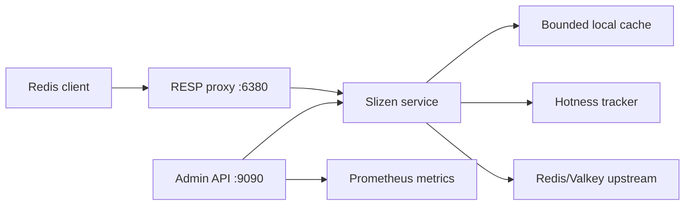

# Architecture

Slizen v0.1 is a single-node adaptive cache layer for read-heavy Redis and Valkey workloads.

## Request flow

GET records a hotness observation, checks the local cache, coalesces concurrent misses with `singleflight`, fetches from upstream on miss, and stores the value locally only after the key is eligible for promotion. MGET preserves input order, uses local hits where possible, and fetches remaining keys from upstream in a batch.

Write commands are sent upstream first. Slizen invalidates local entries only after upstream accepts the write, so it never acknowledges a write that Redis or Valkey rejected.

## Cache model

The local cache is a bounded, in-memory LRU-style cache. Size accounting includes key bytes, value bytes, and a fixed per-entry overhead estimate. This is not exact runtime heap accounting, but the approximation is enforced consistently.

Local TTL is the smaller of the remaining upstream TTL and configured `cache.max_local_ttl`. Upstream keys without expiration use `cache.max_local_ttl`. Missing keys are not cached indefinitely; negative caching is disabled by default.

## Hotness model

The hotness tracker uses bounded per-key state, fixed scoring windows, EWMA decay, promotion hysteresis, and a cooldown state. It avoids retaining a counter for every key ever observed by evicting low-score or old entries when the configured maximum is reached.

## Consistency model

Slizen v0.1 is safe when writes pass through Slizen. External writes directly to Redis or Valkey may remain stale until local TTL expiration. Stale reads during upstream outages are disabled by default and require explicit opt-in.

## Operations

The daemon exposes:

- RESP proxy listener, default `0.0.0.0:6380`.
- HTTP admin listener, default `127.0.0.1:9090`.

The admin listener is unauthenticated in v0.1 and must not be exposed publicly.
